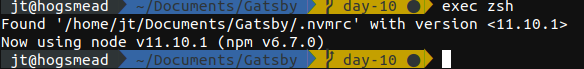
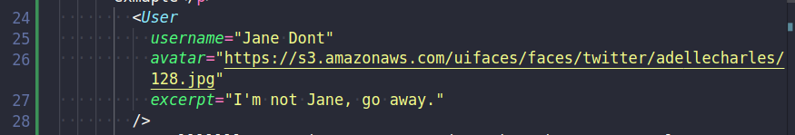
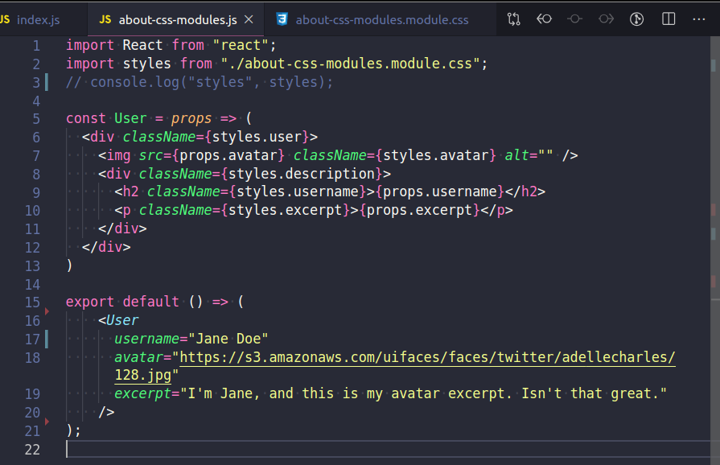

 
## Day 10 - Finishing up zsh components and some nvm love

For whatever reason every time I start up a bash, or more recently a zsh terminal I have to run `nvm install v11.10.1`. That is I need to do that if I'd like to see my Gatsby project running. This is also true if I decide to run gatsby-cli from inside the vs-code terminal...

Overall not that big of a deal right? 15ish characters, heck I've used more than that to whine about it right now.

But it is annoying and you have to remember to do it every time, if only there were a way to set that per project.

Enter the .nvmrc rile! Woo, now I have a simple file that literally just contains number, in my case at the time of this its `11.10.1`. Nothing fancy for sure, and that brings our typing down to `nvm use`. Not a bad change of events, and you don't have to remember what version number to type. Usually I'd be over the moon about that and ready to call it good, but I did notice something while googling around trying to remember just what the .nvmrc file was called.

Remember just a minute ago when I said I've moved back to using zsh? As it turns out nvm & zsh seem to be happy little partners. At least that is according to this <a href="https://github.com/nvm-sh/nvm#zsh">Github doc</a>. For once installing something in my .zshrc and trying to run it didn't have any downsides, everything worked right out of the box as it were.

NVM now auto runs `nvm use` when the little snippet in the .zshrc see a .nvmrc file. Whew! All that just to save 15ish characters..

Now the fun part, lets try and import our fancy about-css-modules exmaple

Welllllll... As it turns out I don't know how to properly setup a component just yet.

Clearly I'm missing something about setting up the module for use in other pages/modules, or maybe just pulling it in the right way. I'm sure it'll be blatently obvious what I'm doing wrong in the near future. Maybe day 11? 15? 25? Hopefully sooner rather than later.

And yes, yes I did update my theme.

On a happy note though, that is all for Gatsbyjs.org tutorial part-two. Moving onto part-three.
