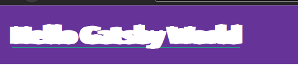
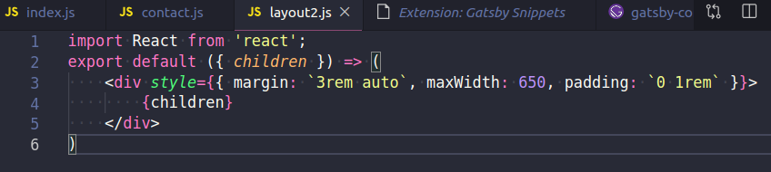
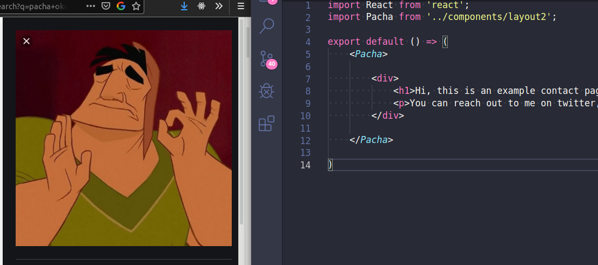
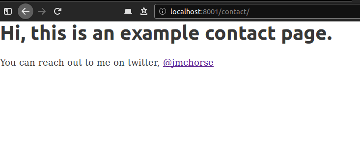
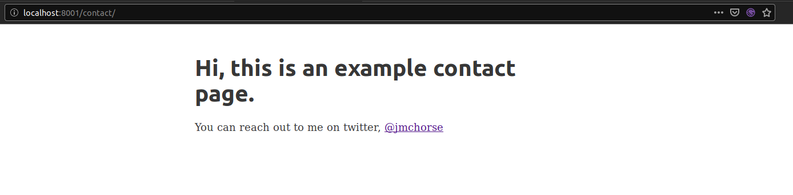

## Gatsbyjs tutorials part-three
  
 Holy typography plugins batman, look at that h1 right now.
  

Interesting little side bar there, installing plugins. Learning how to add multiple plugins to the gatsby-config.js will be useful I imagine.

Moving on to making layouts. Its suggested to start with another new site, but I think I'll keep plugging away with the one I have for now.

Lets make some a new basic type page, /contact will do. And man is it basic. Pure text goodness.

<a href="https://www.gatsbyjs.org/tutorial/part-three/#-create-your-first-layout-component">Gatsby then has us make a new layout</a>, only problem for me is I already have `layout` so I'll name this one layout2.js

I'm sure that can guess what comes next. Contact.js + Layout2

At this point I've come to really despise typing import React from 'react', and because I love keyboard shortcuts and bloating my code editor with plugins I decided to install a Gatsby Snippet pack. Now I just hit Ctrl + Space, type in imr and I'm presented with a lovely little window that will tell me what I'm about to paste.

Thank you nickytonline.

Now to import Layout2 into Contact.js. Yes, yes you guessed it, import that. Here is the fun part for me, we can name it anything we want to when we call it in. Import Pacha? Sure, it'll work and it makes me smile.

However that doesn't really tell me what the thing does. If someone else had to jump in and was looking down through the code.. WTF why Pacha? Or in all reality you are likely to forget why you did what you did in all of 2 or 3 days, let alone coming back to a project months after you put it down. So, yeah. Lets be lame and call it by what it does. Layout2 it is..

So just what does Pacha, I mean.. Layout2 actually give us?

Our layout component takes this basic page, and well wraps a layout around it.

Now that we have a new layout, whenever we make a page we'll just call the layout2 component and all our pages will have the same base look.

If you have ever install the basic gatsby site, you'll see that layouts can house other components as well. Just look up at the nav here, and the footer. Both of those components are inside the layout componet. I bet we'll get to do that pretty soon in the tutorials.
