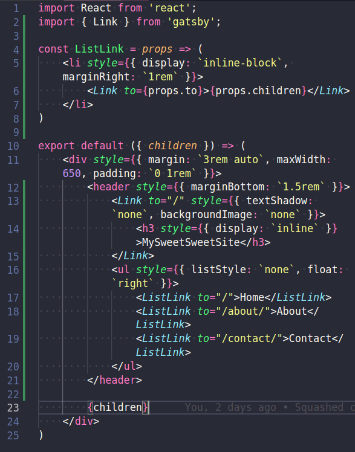
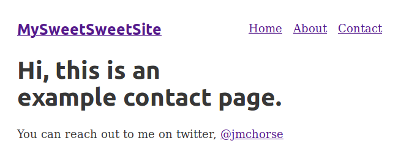

## Continued layout & the Link tag

Add stuff inside the layout we just made.

Todays finishing up of part-three has us adding some navigation elements insid the layout2.js file

 

And now we have navigation links on our [contact](/contact) page

I've been wondering what the difference between the a tag and the link tag is. 

Enter <a href="https://www.gatsbyjs.org/docs/linking-between-pages/">"The Gatsby link component"</a>

Essentially we are told that the link component is supposed to be used for internal gatsby linking, because "but with added performance benefits"..

But, what are those benefits?

In the Other resources section on the docs page we find a link to the <a href="https://www.gatsbyjs.org/docs/gatsby-link/">Gatsby API.</a>

Alright, now we're getting somewhere. A table of contents!

No we are starting to get an idea for some of those "added performance benefits"

ActiveStyle | ActiveClassName | getProps (isCurrent, isPartiallyCurent, href, etc etc)

Cool, so use the link tag for internal links, and if you are going to be running a CMS build <a href="https://www.gatsbyjs.org/docs/gatsby-link/#reminder-use-link-only-for-internal-links">this</a> little helper so you don't have to worrry. It'll render a link for internal and a href for external.

Man I hardly feel like we've scratched the surface with the layouts & api, and thats just Gatsby, we aren't event taking into consideration that Gatsby is really just React.