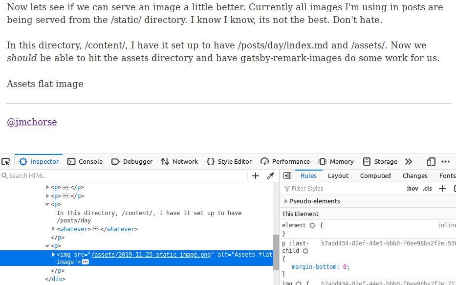
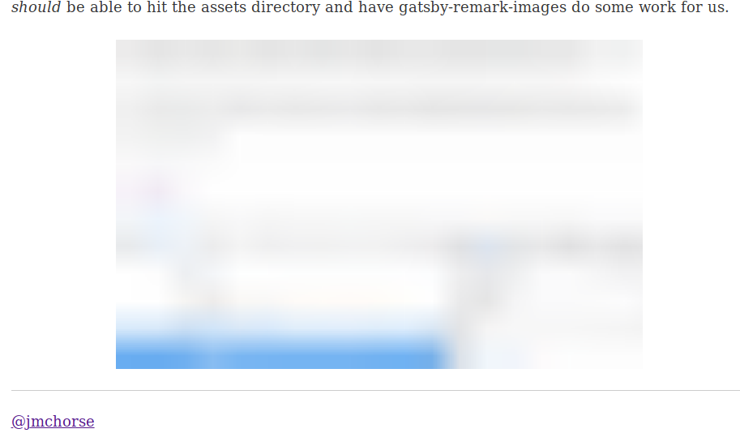
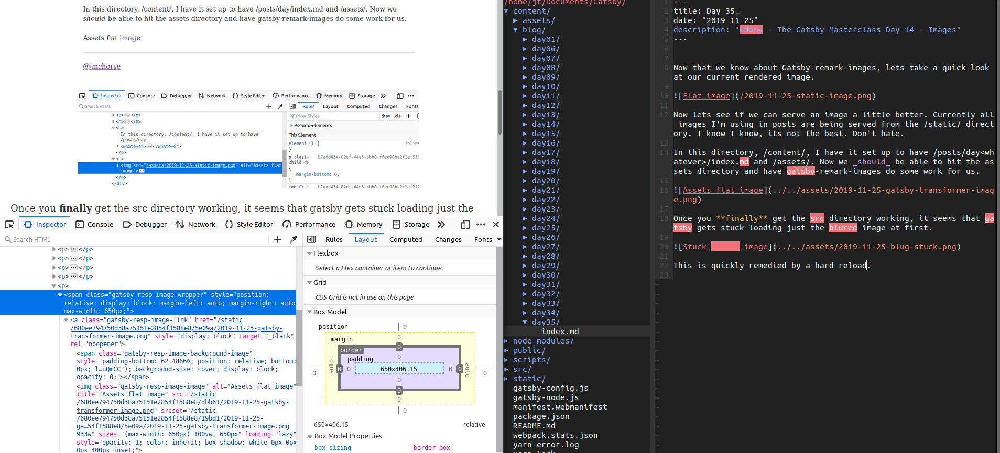

Now that we know about Gatsby-remark-images, lets take a quick look at our current rendered image.

Now lets see if we can serve an image a little better. Currently all images I'm using in posts are being served from the /static/ directory. I know I know, its not the best. Don't hate.

In this directory, /content/, I have it set up to have /posts/day<whatever>/index.md and /assets/. Now we _should_ be able to hit the assets directory and have gatsby-remark-images do some work for us.

Once you **finally** get the src directory working, it seems that gatsby gets stuck loading just the blured image at first.

This is quickly remedied by a hard reload.

Success! Take a look at all this lovely Reacty~Gatsby-e stuff thats happening to the images now.

One does need to load the images slightly different now, however thats a minor price to pay for all the features we gain.
