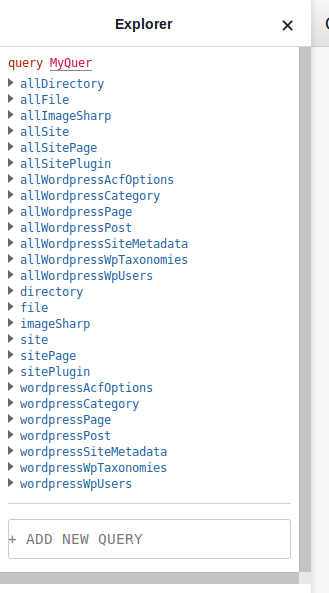
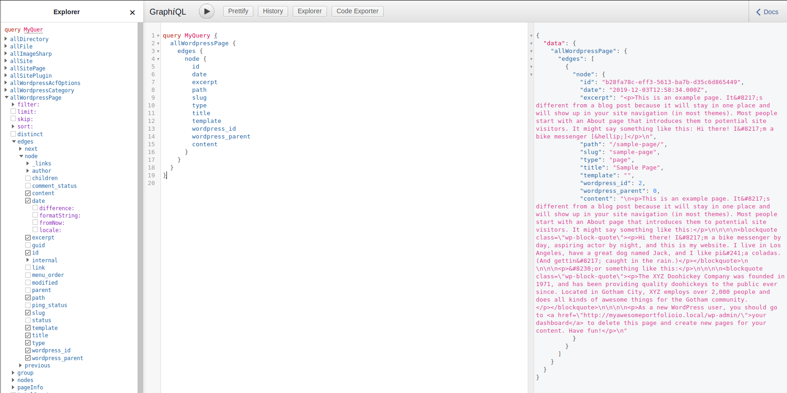

### Gatsby & Wordpress

I have never done any Wordpress development on linux before, this should be interesting.

Local by flywheel - This app had a nearly 100% pain free installation. I got one minor error, which ended up being an issue with port 80. Other than that I was able to install and have a Wordpress example site up and running locally in nearly notime.

Gatsby Wordpress - [gatsby-source-wordpress](https://www.gatsbyjs.org/packages/gatsby-source-wordpress/?=wordpress)

There is link to a nicely thorough post about why we should be using [dotenv](https://www.gatsbyjs.org/docs/environment-variables/)

After install gatsby-source-wordpress, and copying the example gatsby-config settings from the plugin page. I present to you

And while we're mucking about, lets play with GraphiQL.

There we have it for today, new Wordpress local site, new Gatsby site and a new gatsby plugin.
