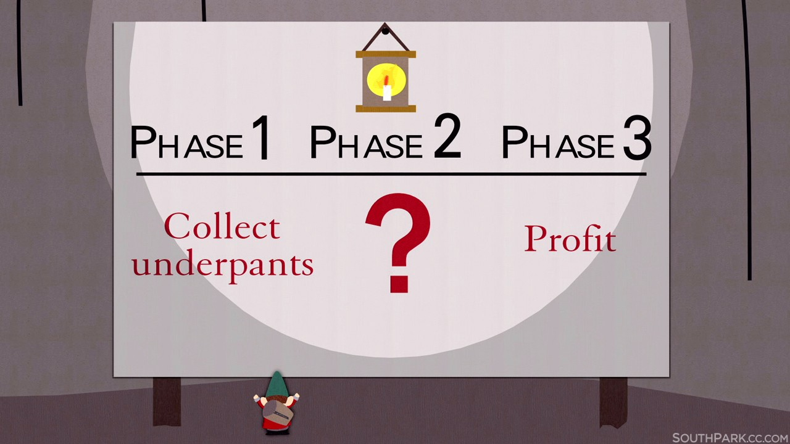

### Wordpress Data

Gatsbyjs.org has a series of blog posts on Wordpress + Gatsby -> [here](https://www.gatsbyjs.org/blog/2019-04-30-how-to-build-a-blog-with-wordpress-and-gatsby-part-2)

We have already done all of this before. [Day 28](/posts/day-28/) coveres some, [Day 15](posts/day-15/) also covers some.

For making pages _from_ wordpress we need to remember a few things.

1 - Get the data from somewhere

2 - Query the _type_ of data - (posts/pages)

3 - Tell gatsby which template to use - (templates/page, templates/post, templates/whatever)

4 - ???

5 - Profit!

Hopefully you all remember the underpants gnomes skit from South Park.

Anyway, those are the basic ideas of how to do something basic with wordpress content. More to follow.
