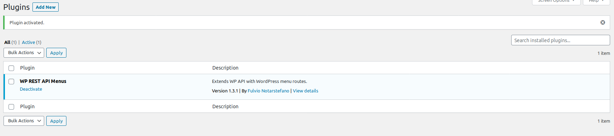
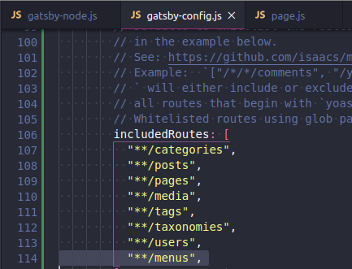

### Menus!

We can create our own json end points, we can return any type of content we'd like.

Currently we need to install a new plugin, so off we go to the Wordpress admin plugin page. Search for "menus api v2" and then install that sucker.

Lets pretend that we've installed said plugin, and have activated it. We will then need to tell Gatsby to look for the new routs. This is part of the Gatsby _Gatsby-source-wordpress_ plugin.

This screen shot is from our 'gatsby-config.js' file.

Once we add the menus into the included routes, we then need to restart our 'gatsby develop' cli. After that head over to Graph_i_QL and we should have some new top level items inside the explorer tab.

TADA! We've got WP menus in GraphiQL! Okay okay, not ground breaking, this was done with all the hard work of whoever made the gatsby-wordpress plugin, and also the wordpress menus api plugin. But come one its super cool!
