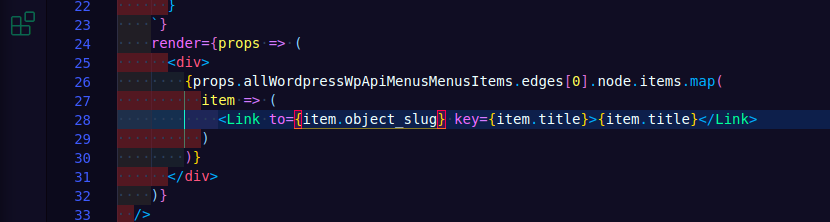

### Rendering menu

Some of this has been standard. 

Build the query, make a new .js page in gatsby and render the query. Add that into our templates so every page gets the query.

Some of it though, still a bit hard to wrap my head around, but hey at least I'm trying right?

There is an interesting article on [dev.to about Gatsby + WP menus](https://dev.to/boussama/complete-guide-to-wordpress-menu-sourcing-in-gatsby-h76). Perhaps it'll be a resource.

