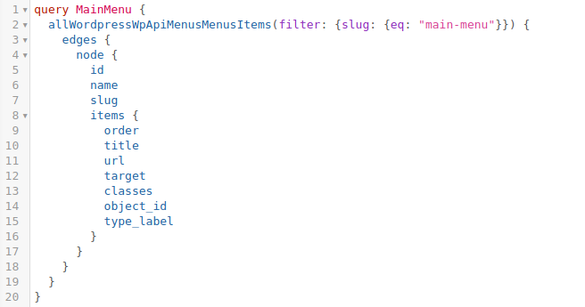

### Menu filtering

Today we went through the filtering process that Graphql can do. I we are building a query to grab a menu, we certainly would want to grab the correct menu, that is assuming there is more than one.

We've been through something similar before -> [Day 31](/posts/day-31/) if you'd like to check out the details on the filtering arguments.
