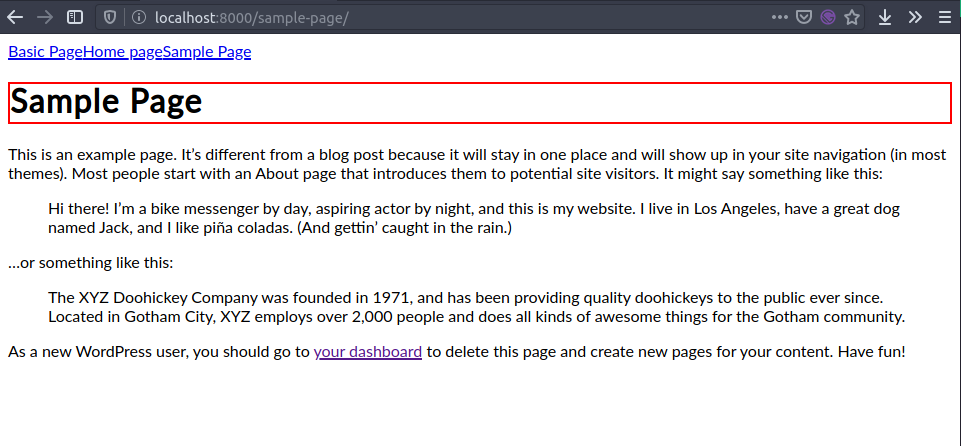

### Styled Components

[Gatsbyjs styled components packages](https://www.gatsbyjs.org/packages/gatsby-plugin-styled-components/)

In theory styled components are fairly easy to implement, but it seems to have been a bit since I've used one. So to the docs we go.

[Gatsby Styled Components docs](https://www.gatsbyjs.org/docs/styled-components/)

And then there is me testing, using my world famous `2px solid red` testing css to figure out where things are.

Come to find out, when you import `GlobalStyledComponents` and declare it as `BlobalStyledComponents` Gatsby doesn't really like that. Gatsby does tell you about how bad you are a spelling though, so look for that in the console and terminal. 
