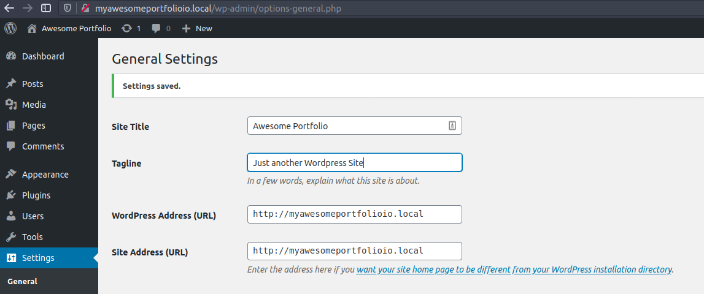
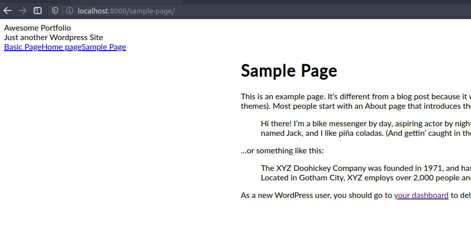

### Wordpress Site title and tagline

If you have ever made a wordpress before you'll have likely seen the "just another wordpress site' tagline. We will be updating that today.

We know the basics of getting information from Wordpress into Gatsby by now. 

1 - GraphiQL query to figure out what we are trying to get.

  in this instance we're looking for `allWordpressSiteMetadata`

2 - Create a new componentName.js file and user previous query
  
  because we are grabbing the site metadata we could call this SiteMetataData.js, or SiteInfo.js or.. whatever works for you.

3 - Do all the imports for our new js file, and all the exports.

4 - Import the new SiteInfo component somewhere to render it, the menu is usually a good place for that. Maybe the footer depeneding on your site.

5 - tada!

Unstyled garbage

This [docs page](https://www.gatsbyjs.org/docs/sourcing-from-wordpress/) will go over some basics as well.

---

Taking a few minutes to run through a [Wes Bos video on Beginner JS course](https://beginnerjavascript.com/). Today -> SNOB'N'US

String
Number
Bool
Null
Undefined
Symbol

