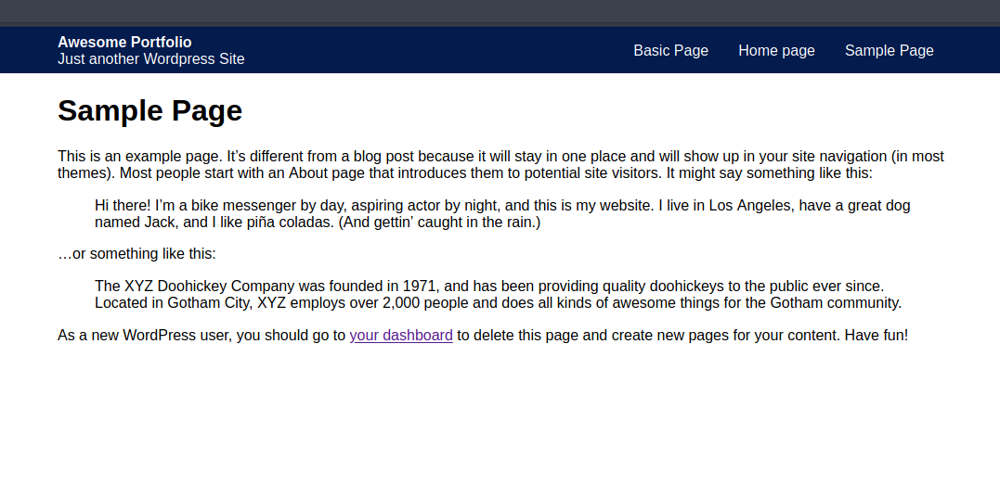

### Styling site title and menu

Flexbox to the rescue!

All in all a fairly uneventful morning with Udemy. This last lesson was slightly longer, and I goofed off slightly more than normal yesterday. So here we are, adding styles in to make the page not just unstyled garbage.

Everyone likes that right?

Here are the rendered styles.

Per usual I often forget how to use flexbox, and I have been using this tool to help me today. [Said tool](https://yoksel.github.io/flex-cheatsheet/#display), I think its very useful and a lovely live demo.

As far as the css goes, we have a wrapper div for the background color. Then we have the site title block, which included the description. And finally we have the menu items. For menus this is fairly simple, but not the most basic markup ever.

Further evidence of all my goofing around yesterday, you can now view this site on my personal url. [jtmchorse.com](http://www.jtmchorse.com/).

Yes I am using a pre-built template. So far I'm very happy with that, and I'll continue to do so for the foreseeable future. 

I am thinking that a nice change would be to make the 100 days of code posts into more of a _dailys_ snippet type of deal. Then I can make *POST* posts, with more detail, or something along those lines.

We'll see how things shake out.

---

### 50 Days! Can't believe I'm already at 50 days!

I don't plan on stopping at 100, this is too much fun.
