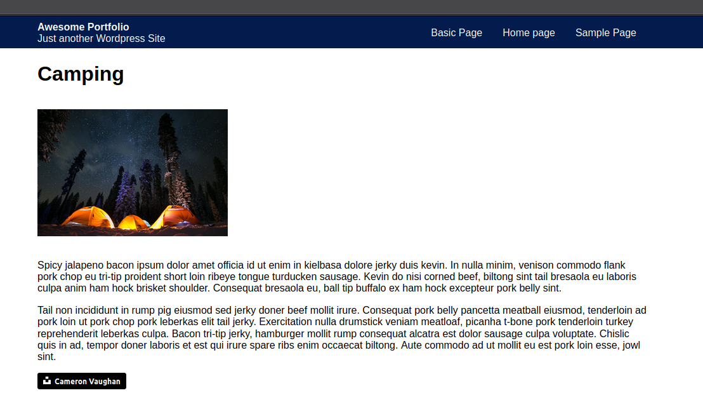
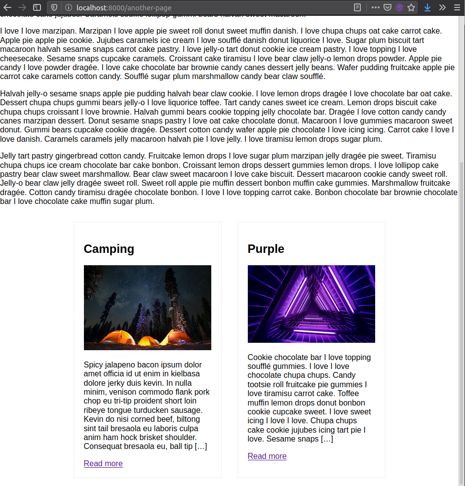

The way this author uses styled components is still somewhat new to me. I think its not quite my preferred method.

While this might seem like nitpicking, or maybe I just don't know any better yet, I prefer to keep my css and js separate. I think the term is CSS Modules, I went over it on [Day 9](/posts/day-9), and you can find the docs about this on [Gatsbyjs](https://www.gatsbyjs.org/tutorial/part-two/#css-modules)

Despite my bitches and moaning about css styled components, which you'll notice if you check out the repo that I do nothing to fix it, the portfolio template has now been styled.

We also still have the portfolio items shown on every `Page` page, so we styled those a little as well.

