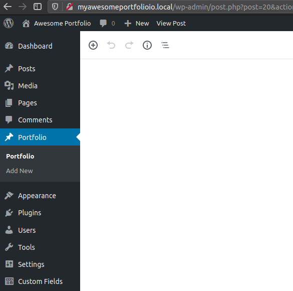
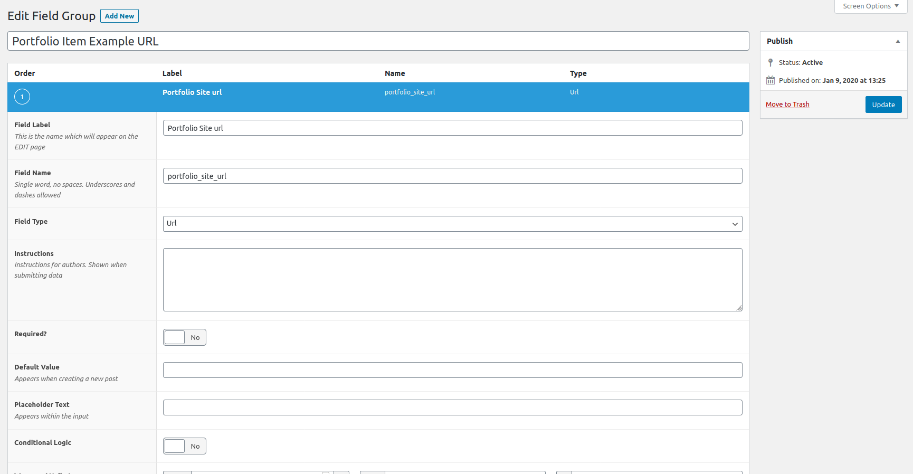
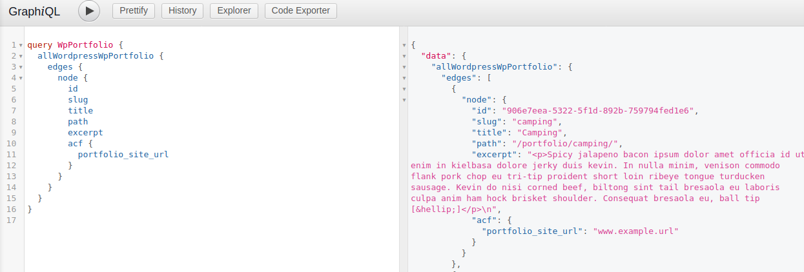

### Wordpress advanced custom fields

1 - install new plugin "ACF" - advanced custom fields

2 - install acf to rest api - so we can query the info into gatsby.

After these are installed, head to the new ACF setting menus in the Wordpress Admin UI. Screenshot to follow.

We will roughly follow these steps outlined below.

1. Add new field group in ACF - "Portfolio", 
2. call it portfolio url
3. type url
4. required
5. post-type = portfolio

Now inside the portfolio posts, there will be a new custom field with a "portfolio url" title. This is so we can show the url of the portfolio piece.

Restart gatsby, head to graphiql, edges, node acf portfoliourl !

Next up, lets build that into Gatsby.

