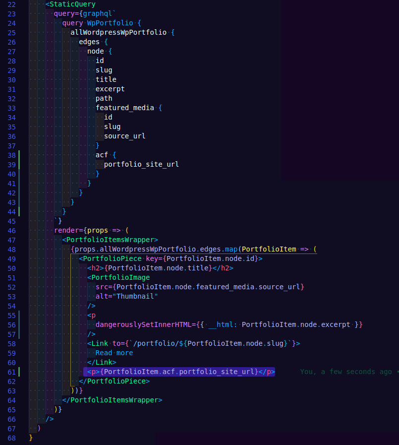
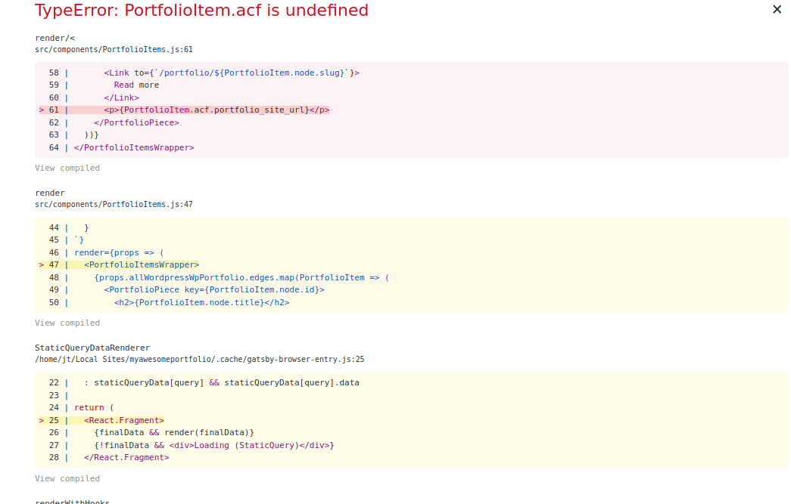
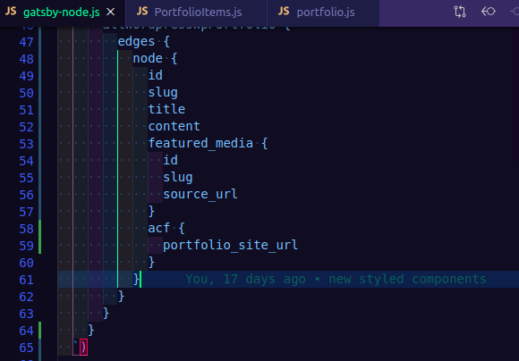
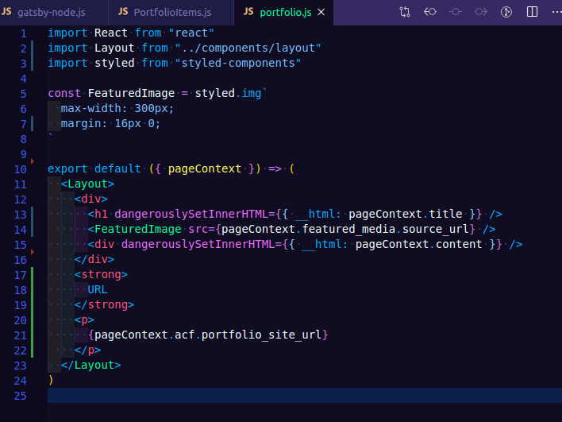

### Show gatsby the GraphiQL

I'm going to try something a little different with this exercise. I have my own ideas of where this should go and how to bring it into the Gatsby theme..

1 - Update our Porfolioitems.js file to include the new query.

2 - Add some markup and extract the query into it.

Example screenshot

3 - Error. Turns out thats not right!

Example screenshot

Bahh, headed down the wrong path.

I was approaching this wrong, the data for the portfolio items content gets called out in gatsby-node.js. That is where we have defined the "allWordpressWpPortfolio" items.

With this query parameter added here, we can then head right over to the `portfolio.js` page and access it there.

Here is an example of accessing that data.

Yes we will need to change that to an anchor, but I was just so excited to get that data there given my early try and fail.

